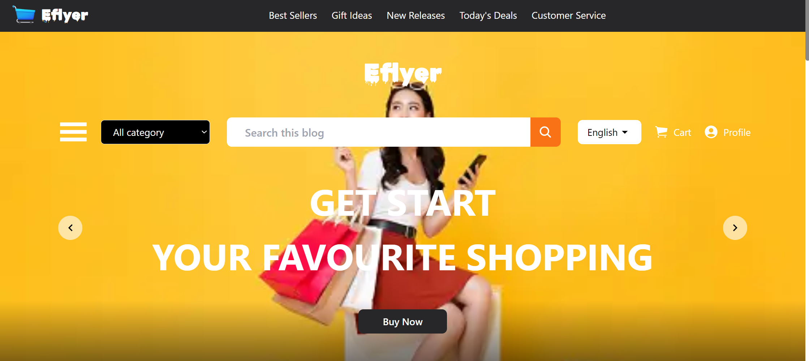
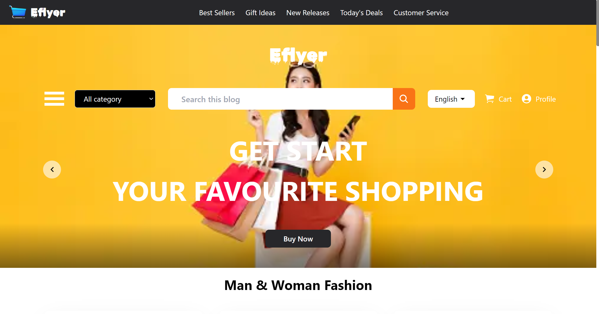
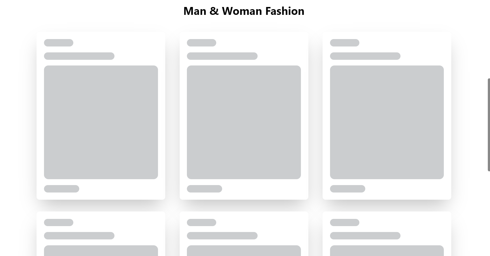
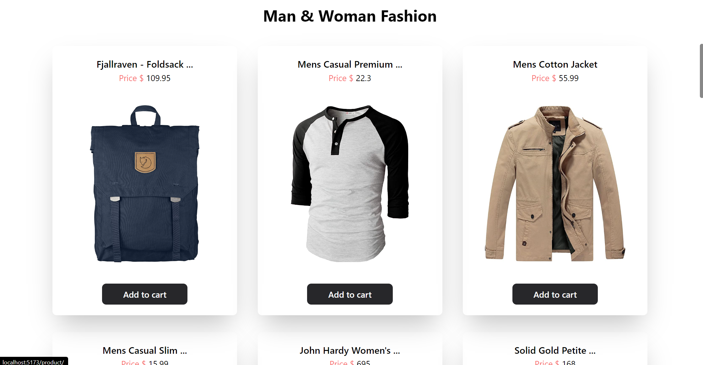

# Eflyer

<h2>Live link 🌍📡 - [  https://eflyer-react-js.vercel.app/  ]</h2>

## Description 📝
This project is an interactive e-commerce platform built using ReactJS, Tailwind CSS, and Redux Toolkit.    
It allows users to explore and search for products based on available categories or by entering specific search queries.    
The project leverages the Fake Store API to fetch product data dynamically.

## Tech Stack 💻🔧 
<code title="React.js"></code>
<code title="Vite"></code>
<code title="Redux.js"></code>
<code title="css"></code>
<code title="Tailwind css"></code>

## Features 📚 
- **Category-Based Navigation 🛒 :** Users can browse products by selecting from a list of available categories, providing a streamlined shopping experience.
- **Search Functionality 🔍 :** The project enables users to search for products by entering keywords or phrases, making it easy to find specific items of interest.
- **Lazy Load Image Library 🖼️ :** To optimize performance and enhance user experience, the project integrates lazy loading of images using a dedicated library.
- **State Management with Redux Toolkit 🔄 :** Redux Toolkit is employed for efficient state management, ensuring seamless data handling and updates throughout the application.
- **Tailwind CSS Styling 🎨 :** The project utilizes Tailwind CSS for styling, allowing for quick and responsive design implementation across various devices and screen sizes.
- **Custom Loading Skeleton 💀 :** A custom loading skeleton is implemented to provide visual feedback to users while product data is being fetched, enhancing perceived performance.
- **Dynamic Navbar 📜 :** Enhance user experience with a dynamic navbar that intelligently adjusts its visibility as users scroll through the page. When scrolling down, the navbar gracefully hides to provide a distraction-free view of the content. Upon slight upward scrolling, the navbar smoothly reappears, ensuring easy access to navigation options without obstructing the user's browsing experience.

## React Hooks 🎣
- `useState`
- `useEffect`
- `useDispatch`
- `useSelector`
- `useNavigate`
- `useRef`
- `Custom-Hook`

##  🖥️ Screen Preview :

# Home Page 🏠 

# Loading Skeleton ⏳

# Products List 🛍️

## Footer 🌟

